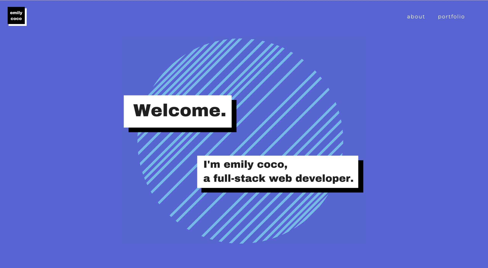

# emilycoco
This is my personal [website](http://emilycoco.herokuapp.com/) to show my work portfolio and experience.  
It includes links to my github, linkedIn and a request to email me.



## Getting started
1. Fork and clone down the repo.

```shell
 git clone CLONE_URL
 cd emilycoco
  ```
  2. Install packages and run the server.

```shell
 yarn 
 yarn dev
  ```
